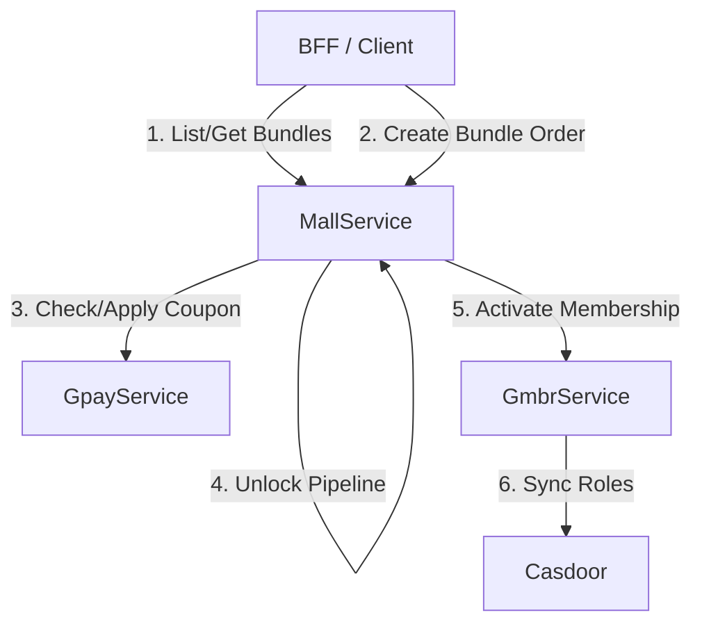

# BFF Integration Checklist & Migration Guide (gmbr/Bundle Re-architecture)

This document outlines the API, schema, and flow changes introduced in the `gmbr` branch. These changes enable `gmall` to support external purchasing via a unified **Bundle** model (allowing "membership" and "pipeline" to be bundled together).

---

## 🚀 High-Level Architecture & Concept Shift



1. **Pricing Authority**: GCC (Go Course Catalog) no longer contains Stripe price or product IDs. `gmall`'s `bundles` table is now the sole source of truth for pricing.
2. **Purchase Entry Point**: All purchases (even single pipelines) are now treated as a **Bundle Purchase**. The old pipeline purchase RPC has been removed.
3. **Membership Identity**: A new service `gmbr` (Membership) manages user membership identity, tiers, expiration dates, and billing history. Membership pricing and bundle associations are managed in `gmall`.

---

## 📋 BFF API Integration Checklist

| Flow / Feature | Action Required | Service / RPC | Details |
| :--- | :--- | :--- | :--- |
| **Product Catalog** | **Replace** GCC queries | `MallService.ListBundles`<br>`MallService.GetBundle` | Query the `gmall` bundle configuration for product display and pricing. |
| **Pipeline Purchase** | **Replace** `CreatePipelineOrder` | `MallService.CreateBundleOrder` | Buy single pipelines or pipeline+membership packages via the Bundle interface. |
| **Pipeline Unlock** | **Modify** parameters | `MallService.CreatePipelineUnlockOrder` | Pass `bundle_id` to locate the unlock price definition. |
| **Stage Payment** | *No parameter changes* | `MallService.CreateStageOrder` | Behind the scenes, prices are read from the parent `bundle_order` snapshot. |
| **Course Retake** | **Modify** parameters | `MallService.CreateCourseRetakeOrder` | Pass `bundle_order_ulid` to locate unit retake pricing snapshot. |
| **Resume / Preview Payment** | **Update** `biz_type` and ref | `MallService.InitiatePayment`<br>`MallService.PreviewPayment` | Set `biz_type = "BUNDLE_PURCHASE"` and `biz_ref_ulid = bundle_order_ulid`. |
| **Membership Dashboard** | **New Service Integration** | `GmbrService.GetActiveMembership`<br>`GmbrService.ListUserMemberships`<br>`GmbrService.ListMembershipBillings` | Fetch active membership status, history, and invoices. |
| **Membership Cancel** | **New Service Integration** | `GmbrService.CancelMembership` | Cancel auto-renewal for a membership subscription. |

---

## 🛠️ API & Flow Details

### 1. Purchasing via Bundle Order

The `CreatePipelineOrder` RPC has been **deleted**. BFF must migrate to `CreateBundleOrder`.

#### `MallService.CreateBundleOrder`
* **Request (`CreateBundleOrderRequest`)**:
  ```protobuf
  message CreateBundleOrderRequest {
    string candidate_ulid           = 1; // Required
    string bundle_id                = 2; // Required: version ULID of the Bundle
    string payment_mode             = 3; // Required: "FULL_PIPELINE" or "BY_STAGE"
    string selected_exemptions_json = 4; // Optional: JSON map for exemptions (see structure below)
  }
  ```

* **`selected_exemptions_json` Structure**:
  Since a bundle can contain multiple pipelines, chosen exemptions are mapped by their `pipeline_cc_ulid`:
  ```json
  {
    "pipeline_cc_ulid_A": {
      "stages": [
        {
          "stage_cc_ulid": "stage_cc_ulid_X",
          "exempted_unit_cc_ulids": ["course_unit_cc_ulid_1", "course_unit_cc_ulid_2"]
        }
      ]
    },
    "pipeline_cc_ulid_B": {
      "stages": []
    }
  }
  ```

* **Response (`CreateBundleOrderResponse`)**:
  ```protobuf
  message CreateBundleOrderResponse {
    string bundle_order_ulid    = 1;
    string order_status         = 2; // e.g., "WAIT_BUNDLE_PAYMENT", "COMPLETED"
    string bundle_pay_order_ulid= 3; // Refers to the physical payment order
    string payment_key          = 4; // Stripe Checkout URL or client secret (if applicable)
    bool   reused_existing      = 5;
    string message              = 6;
  }
  ```

> [!IMPORTANT]
> **Zero-Dollar Auto-Completion**: If a bundle order requires no payment (e.g., all stages are exempted, or a membership is 100% covered by a coupon), `order_status` will return as `COMPLETED` immediately and `payment_key` will be empty. BFF should check for this status to bypass Stripe and redirect candidates directly to the dashboard.

---

### 2. Pipeline Unlock Order

Unlocking a pipeline now requires linking to the specific Bundle configuration containing the unlock pricing.

#### `MallService.CreatePipelineUnlockOrder`
* **Request (`CreatePipelineUnlockOrderRequest`)**:
  ```protobuf
  message CreatePipelineUnlockOrderRequest {
    string candidate_ulid   = 1; // Required
    string pipeline_cc_ulid = 2; // Required
    string bundle_id        = 3; // NEW: Version ULID of the Bundle
  }
  ```

---

### 3. Course Retake Order

Retake prices are now read from the frozen snapshot in the bundle order.

#### `MallService.CreateCourseRetakeOrder`
* **Request (`CreateCourseRetakeOrderRequest`)**:
  ```protobuf
  message CreateCourseRetakeOrderRequest {
    string course_unit_ulid    = 1;
    string course_unit_cc_ulid = 2;
    string candidate_ulid      = 3;
    uint32 retried_count       = 4;
    string bundle_order_ulid   = 5; // NEW: Parent bundle order ULID
  }
  ```

---

### 4. Resume & Preview Payment

When resuming payment from the history page or previewing discounts, support the new `BUNDLE_PURCHASE` business type.

* **Endpoints**: `MallService.InitiatePayment` & `MallService.PreviewPayment`
* **Usage**:
  * Set `biz_type = "BUNDLE_PURCHASE"`
  * Set `biz_ref_ulid = bundle_order_ulid`

---

### 5. Membership Management (`GmbrService`)

For pages displaying membership information, benefits, subscription status, and billing details, BFF must call the new `GmbrService`.

#### A. Query Membership Schema
* `GmbrService.ListMemberships` (Pagination via `page`, `page_size`)
* `GmbrService.GetMembership` (By `membership_ulid`)
* **Response Payload highlights**:
  * `casdoor_role_name`: The corresponding RBAC role in Casdoor (e.g. `member-affiliate`).
  * `duration_in_months`: Period length (usually `12`).
  * `tier_level`: Membership hierarchy level (e.g., for comparative upgrades).
  * `features_json`: Feature matrices/benefits.

#### B. Query Candidate Subscription Status
* `GmbrService.GetActiveMembership(GetActiveMembershipRequest)`:
  * **Returns**: The current active `UserMembership` and `course_discount_coupon` (automatic stripe coupon for other purchases).
  * **UserMembership status values**: `active`, `expired`, `cancelled`, `grace_period` (past due, but benefits still active).
* `GmbrService.ListUserMemberships`: Get subscription history.

#### C. Candidate Invoices & Receipts
* `GmbrService.ListMembershipBillings(ListMembershipBillingsRequest)`:
  * Returns list of `MembershipBilling` records for a user's subscription cycles (initial purchase, auto-renewal, manual adjustments).
  * Contains `gpay_order_ulid`, which BFF can pass to `gpay` to fetch the invoice PDF or receipt page.

#### D. Cancel Membership (Cancel Auto-Renew)
* `GmbrService.CancelMembership(CancelMembershipRequest)`:
  * **Parameters**: `membership_record_id`, `reason = "user_requested"`
  * **Behavior**: Stripe subscription is set to cancel at period end. The status remains `active` until `expires_at`, at which point it is marked as `expired` and the Casdoor role is revoked.

---

## 🏛️ Database Columns Reference (BFF Data Layer)

If the BFF maintains its own DB caching or views, note the following schema additions on branch `gmbr`:

| Table | Added Column | Type | Description |
| :--- | :--- | :--- | :--- |
| `pipeline_orders` | `bundle_order_ulid` | `VARCHAR(26)` | Parent bundle order ULID. |
| `course_retake_orders` | `bundle_order_ulid` | `VARCHAR(26)` | Parent bundle order ULID. |
| `pipeline_unlock_orders` | `bundle_id` | `VARCHAR(26)` | Bundle version ULID. |
| `orders` | `biz_type` constraint | `VARCHAR(32)` | Added `'BUNDLE_PURCHASE'` as a valid enum value. |
