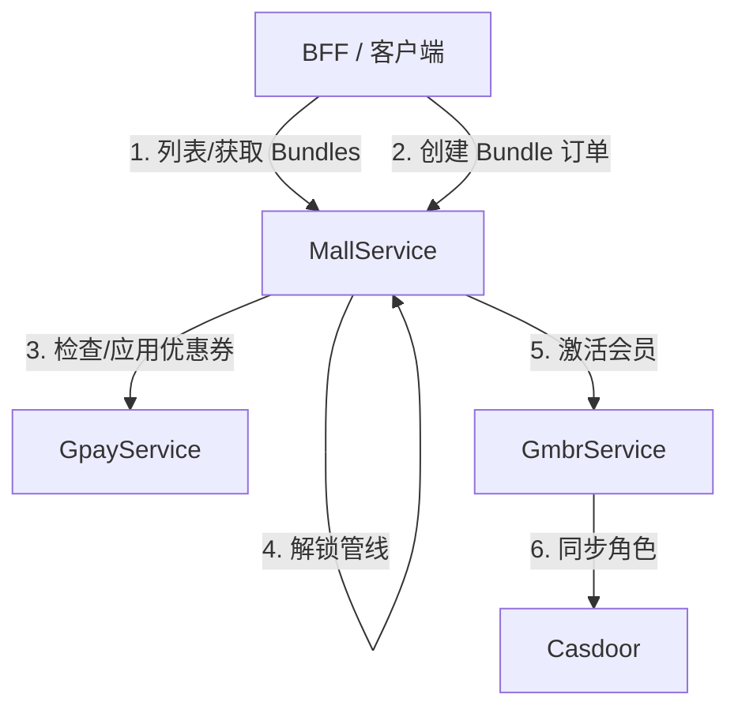

# BFF 接入清单与迁移指南 (gmbr/Bundle 重构)

本文档概述了在 `gmbr` 分支中引入的 API、数据库 Schema 以及流程变更。这些变更使得 `gmall` 能够通过统一的 **Bundle (组合包)** 模型支持对外购买（允许将“会员”和“管线”打包在一起）。

---

## 🚀 高层架构与概念转变



1. **定价权转移**：GCC (Go 课程目录) 不再包含 Stripe 的 price 或 product IDs。`gmall` 的 `bundles` 表现在是定价的唯一真实来源。
2. **购买入口统一**：所有的购买（即使是单一管线）现在都被视为一次 **Bundle Purchase (组合包购买)**。旧的管线购买 RPC 已被移除。
3. **会员身份管理**：新增了 `gmbr` (会员服务) 来管理用户的会员身份、等级、过期时间以及账单历史。会员定价和组合包的关联由 `gmall` 管理。

---

## 📋 BFF API 接入清单

| 流程 / 功能 | 所需操作 | 服务 / RPC | 详情 |
| :--- | :--- | :--- | :--- |
| **产品目录** | **替换** GCC 查询 | `MallService.ListBundles`<br>`MallService.GetBundle` | 查询 `gmall` 的 bundle 配置以展示产品和定价。 |
| **管线购买** | **替换** `CreatePipelineOrder` | `MallService.CreateBundleOrder` | 通过 Bundle 接口购买单一管线或“管线+会员”套餐。 |
| **管线解锁** | **修改** 参数 | `MallService.CreatePipelineUnlockOrder` | 传入 `bundle_id` 以定位解锁定价定义。 |
| **分期支付 (Stage Payment)** | *参数无变化* | `MallService.CreateStageOrder` | 在后台，价格从父级 `bundle_order` 的快照中读取。 |
| **课程重考** | **修改** 参数 | `MallService.CreateCourseRetakeOrder` | 传入 `bundle_order_ulid` 以定位单元重考的定价快照。 |
| **恢复 / 预览支付** | **更新** `biz_type` 与 ref | `MallService.InitiatePayment`<br>`MallService.PreviewPayment` | 设置 `biz_type = "BUNDLE_PURCHASE"` 且 `biz_ref_ulid = bundle_order_ulid`。 |
| **会员仪表盘** | **新服务接入** | `GmbrService.GetActiveMembership`<br>`GmbrService.ListUserMemberships`<br>`GmbrService.ListMembershipBillings` | 获取活跃的会员状态、历史记录和发票。 |
| **取消会员** | **新服务接入** | `GmbrService.CancelMembership` | 取消会员订阅的自动续费。 |

---

## 🛠️ API & 流程详情

### 1. 通过 Bundle 订单购买

`CreatePipelineOrder` RPC 已经被 **删除**。BFF 必须迁移到 `CreateBundleOrder`。

#### `MallService.CreateBundleOrder`
* **Request (`CreateBundleOrderRequest`)**:
  ```protobuf
  message CreateBundleOrderRequest {
    string candidate_ulid           = 1; // 必填
    string bundle_id                = 2; // 必填: Bundle 的版本 ULID
    string payment_mode             = 3; // 必填: "FULL_PIPELINE" 或 "BY_STAGE"
    string selected_exemptions_json = 4; // 选填: 用于免考的 JSON 映射（见下方结构）
  }
  ```

* **`selected_exemptions_json` 结构**:
  由于一个 bundle 可以包含多条管线，选择的免考将通过它们的 `pipeline_cc_ulid` 进行映射：
  ```json
  {
    "pipeline_cc_ulid_A": {
      "stages": [
        {
          "stage_cc_ulid": "stage_cc_ulid_X",
          "exempted_unit_cc_ulids": ["course_unit_cc_ulid_1", "course_unit_cc_ulid_2"]
        }
      ]
    },
    "pipeline_cc_ulid_B": {
      "stages": []
    }
  }
  ```

* **Response (`CreateBundleOrderResponse`)**:
  ```protobuf
  message CreateBundleOrderResponse {
    string bundle_order_ulid    = 1;
    string order_status         = 2; // 例如, "WAIT_BUNDLE_PAYMENT", "COMPLETED"
    string bundle_pay_order_ulid= 3; // 指向物理支付订单
    string payment_key          = 4; // Stripe Checkout URL 或 client secret (如适用)
    bool   reused_existing      = 5;
    string message              = 6;
  }
  ```

> [!IMPORTANT]
> **零元订单自动完成**：如果一个 bundle 订单不需要支付（例如，所有阶段都被免考，或者会员被优惠券 100% 抵扣），`order_status` 将立即返回 `COMPLETED` 并且 `payment_key` 为空。BFF 应该检查这个状态以绕过 Stripe，直接将考生重定向到仪表盘。

---

### 2. 管线解锁订单

解锁一条管线现在需要关联到包含解锁定价的特定 Bundle 配置。

#### `MallService.CreatePipelineUnlockOrder`
* **Request (`CreatePipelineUnlockOrderRequest`)**:
  ```protobuf
  message CreatePipelineUnlockOrderRequest {
    string candidate_ulid   = 1; // 必填
    string pipeline_cc_ulid = 2; // 必填
    string bundle_id        = 3; // 新增: Bundle 的版本 ULID
  }
  ```

---

### 3. 课程重考订单

重考价格现在从 bundle 订单中冻结的快照读取。

#### `MallService.CreateCourseRetakeOrder`
* **Request (`CreateCourseRetakeOrderRequest`)**:
  ```protobuf
  message CreateCourseRetakeOrderRequest {
    string course_unit_ulid    = 1;
    string course_unit_cc_ulid = 2;
    string candidate_ulid      = 3;
    uint32 retried_count       = 4;
    string bundle_order_ulid   = 5; // 新增: 父级 bundle 订单 ULID
  }
  ```

---

### 4. 恢复 & 预览支付

当从历史页面恢复支付或预览折扣时，支持新的 `BUNDLE_PURCHASE` 业务类型。

* **Endpoints**: `MallService.InitiatePayment` & `MallService.PreviewPayment`
* **用法**:
  * 设置 `biz_type = "BUNDLE_PURCHASE"`
  * 设置 `biz_ref_ulid = bundle_order_ulid`

---

### 5. 会员管理 (`GmbrService`)

对于展示会员信息、权益、订阅状态以及账单详情的页面，BFF 必须调用新的 `GmbrService`。

#### A. 查询会员 Schema
* `GmbrService.ListMemberships` (通过 `page`, `page_size` 分页)
* `GmbrService.GetMembership` (通过 `membership_ulid`)
* **Response Payload 亮点**:
  * `casdoor_role_name`: Casdoor 中对应的 RBAC 角色 (例如 `member-affiliate`)。
  * `duration_in_months`: 周期长度 (通常是 `12`)。
  * `tier_level`: 会员等级层级 (例如用于比较升级)。
  * `features_json`: 权益矩阵/好处。

#### B. 查询考生订阅状态
* `GmbrService.GetActiveMembership(GetActiveMembershipRequest)`:
  * **返回**: 当前活跃的 `UserMembership` 以及 `course_discount_coupon` (用于其他购买的自动 stripe 优惠券)。
  * **UserMembership status 值**: `active` (活跃), `expired` (已过期), `cancelled` (已取消), `grace_period` (宽限期：已逾期但权益仍有效)。
* `GmbrService.ListUserMemberships`: 获取订阅历史。

#### C. 考生发票 & 收据
* `GmbrService.ListMembershipBillings(ListMembershipBillingsRequest)`:
  * 返回用户订阅周期的 `MembershipBilling` 记录列表 (首次购买、自动续费、人工调整)。
  * 包含 `gpay_order_ulid`，BFF 可以将其传给 `gpay` 以获取发票 PDF 或收据页面。

#### D. 取消会员 (取消自动续费)
* `GmbrService.CancelMembership(CancelMembershipRequest)`:
  * **参数**: `membership_record_id`, `reason = "user_requested"`
  * **行为**: 将 Stripe 订阅设置为在周期结束时取消。状态将保持为 `active` 直到 `expires_at`，到达该时间点后会被标记为 `expired` 并且 Casdoor 角色将被撤销。

---

## 🏛️ 数据库列参考 (BFF 数据层)

如果 BFF 维护了自己的数据库缓存或视图，请注意 `gmbr` 分支上的以下 Schema 新增内容：

| 表名 | 新增列 | 类型 | 描述 |
| :--- | :--- | :--- | :--- |
| `pipeline_orders` | `bundle_order_ulid` | `VARCHAR(26)` | 父级 bundle 订单 ULID。 |
| `course_retake_orders` | `bundle_order_ulid` | `VARCHAR(26)` | 父级 bundle 订单 ULID。 |
| `pipeline_unlock_orders` | `bundle_id` | `VARCHAR(26)` | Bundle 版本 ULID。 |
| `orders` | `biz_type` 约束 | `VARCHAR(32)` | 增加了 `'BUNDLE_PURCHASE'` 作为有效的枚举值。 |
